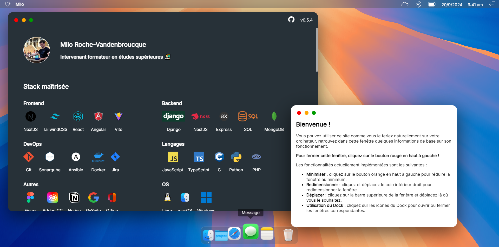

# Milo Roche-Vandenbroucque's online portfolio

This is the repository on wich you can find the source code of my [online portfolio](https://miloroche.fr).

## Description

This website mimics the macOS operating system to offer a different user experience during navigation. The dock, windows, and menu bar are functional.

## Stack

Are used in this project :

1. [ReactJS](https://reactjs.org/) / JavaScript
2. [SCSS](https://sass-lang.com/) with sass preprocessor
3. [Draggable](https://www.npmjs.com/package/react-draggable) npm package

## Changelog

### 0.5.1 (current)

- Window buttons now have icons inside them on hover
- Fixed resize indicator

### 0.5.0

- Windows are now resizeable !
- Bug fixes and improvements

### 0.4.0

- Added a fake Login page
- Added shortcuts instead of URL input on InternalBrowser
- Fixed z-index bug on InternalBrowser
- Changed animation on "session load"
- Bug fixes and improvements

### 0.3.5

- Added an internal browser to mimic safari (iframe)
- Added a Welcome Animation
- Fixes and improvements

### 0.3.4

- Added completed recent changelog in this README
- Fixed tutorial window's draggable handle
- Temporarily removed "Links" window
- Added titles on menu bar icons
- Enhanced PWA support
- New Application Icon

### 0.3.3

- Added some known tech platforms
- Added differents menus depending on focused window
- Fixed overflow on html body on some browsers
- Removed user-select on tutorial window

### 0.3.2

- Added GitHub repo's link
- Fixed z-index on newly opened window
- Updated the Dock and icons
- Fixed initial width on mobile

### 0.3.1

- Added technos icons and grid layout
- Dock icons are now loaded from the server and not an external link
- Added missing indexes on .map() functions

### 0.3.0

- Added Draggable and focused windows
- Removed background repeat
- Added basic welcome animations

### 0.2.1

- Added titles
- Fixed some CSS
- Removed package-lock

### 0.2.0

- Separated everything in different components
- Added custom scrollbar
- Added first sections and navigation toolbar
