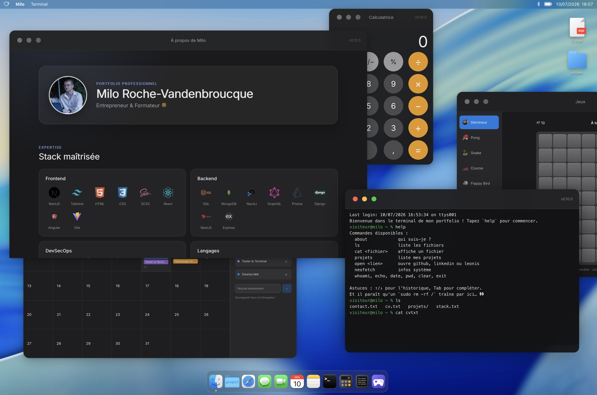

# Online portfolio

This is the repository on which you can find the source code of my [online portfolio](https://miloroche.fr).

## Description

This website mimics the macOS operating system to offer a different user experience during navigation. The dock, windows, and menu bar are functional.

## Stack

Are used in this project :

1. [ReactJS](https://reactjs.org/) / JavaScript
2. [SCSS](https://sass-lang.com/) with sass preprocessor
3. [Draggable](https://www.npmjs.com/package/react-draggable) npm package
4. [Resizable](https://www.npmjs.com/package/react-resizable) npm package

## Changelog

### 0.14.0
- Migrated from Create React App to Vite + Vitest : builds in under a second, maintained toolchain, same 154 tests
- Standalone ESLint, autoprefixer kept for CSS compatibility
- GitHub Actions CI : lint, tests and build on every push
- Playwright end-to-end tests : desktop loading, Dock open/close, window dragging, Terminal commands and Minesweeper on the real production build

### 0.13.4
- Bug fixes : keyboard-accessible Dock, first-click-safe Minesweeper, default windows open when resizing to desktop width, `cat` shows project cards in the Terminal's projets folder
- French `lang` metadata, removed the hardcoded version tooltip, README typos

### 0.13.3
- Code cleanup : condensed repetitive JSX (Calendar view switch, Snake status, Doodle Jump tilt labels)

### 0.13.2
- Code cleanup : removed superfluous defensive code (impossible guards, unused injection points, low-value test)

### 0.13.1
- Code cleanup : shared game utilities (frame-time normalization, best-score storage, touch controls) mutualized across the mini-games

### 0.12.9
- Added a table of contents to the Curriculum with smooth scrolling
- New profile actions : contact me on LinkedIn and download the CV
- More tests and bug fixes

### 0.12.8
- Big Terminal update : themes, navigable file system, persistent history, man pages, better completion and clickable links
- More tests

### 0.12.7
- Reworked the Calendar : full month grid, day / week / list views, richer editable events
- Timezone fixes and more tests

### 0.12.6
- Reworked Notes : search, pinned notes, colors and safer saving with undoable deletion
- More tests

### 0.12.5
- The Console is now a real application observer : filters, counters, pause, search and exports
- Keyboard shortcuts and more tests

### 0.12.4
- Rebuilt the Calculator engine : reliable chained operations, memory keys, percentages and copy
- Keyboard feedback and more tests

### 0.12.3
- Improved Safari : persistent favorites and history, new shortcuts, cleaner toolbar
- Safer page loading and more tests

### 0.12.2
- Privacy-first FaceTime : explicit camera permission, pre-call preview, mic controls and clear error states
- More tests

### 0.12.1
- Improved Messages : timestamps, delivery states, persistent conversation and clickable suggestions
- Fixes and more tests

### 0.11.10
- Reworked Simon : new board design, sounds, progressive speed and a strict mode
- More tests

### 0.11.9
- Reworked Frogger : bigger world with a river, lives, timer, levels and touch controls
- More tests

### 0.11.8
- Reworked Doodle Jump : animated character, new platform types, bonuses, touch and tilt controls
- More tests

### 0.11.7
- Reworked Space Invaders : pixel-art sprites, enemy fire, lives, waves and touch controls
- More tests

### 0.11.6
- Reworked 2048 : animations, end-game screens, touch gestures, undo and best score
- More tests

### 0.11.5
- Reworked Flappy Bird : new visuals, touch controls, best score and progressive difficulty
- Fairer collisions and more tests

### 0.11.4
- Reworked the racing game : detailed sprites, acceleration and braking, damage gauge and progressive difficulty
- More tests

### 0.11.3
- Improved Snake : new visuals, progressive speed, best score, pause and an optional wall-traversal mode
- More tests

### 0.11.2
- Improved Pong : ball trail, impact effects, serve countdown and fairer collisions
- More tests

### 0.11.1
- Improved Minesweeper : classic scoreboard with timer, status face and flag limit
- First game regression tests

### 0.10.7
- Code cleanup on the Dock and the games (one module per game)
- More tests

### 0.10.6
- Expanded the test suite before bigger refactors

### 0.10.5
- Every app now shares a common window frame : consistent look, dragging, resizing and a working fullscreen
- Window sizes and positions are persisted together

### 0.10.4
- Centralized window management in a reducer and a declarative registry
- App.jsx went from ~700 lines to under 200

### 0.10.3
- Removed Google Fonts, switched to the native system font (San Francisco on Apple devices)
- Windows are now lazy-loaded with React.lazy : ~40% smaller initial bundle
- Optimized image loading (lazy loading on stack icons and logos)
- Refactored the main window : icon lookup objects and a single StackSection component instead of duplicated ternary chains

### 0.10.2
- New window animations : zoom + fade on open, simplified genie effect on close/minimize
- The yellow button now really minimizes windows into the Dock (state preserved, click the Dock icon to restore)
- Menu bar clock now uses the macOS date format ("jeu. 10 juil.")
- Bug fixes and improvements (stable window keys)

### 0.10.1
- Keyboard inputs no longer leak between apps (Calculator and Games only listen when focused)
- Saved window positions are clamped to the viewport : no more windows stranded off-screen
- The "running app" dot in the Dock is now dynamic for every open app
- Fixed invalid React keys in the main window

### 0.10.0
- Added Games App with integrated mini-games
- Added Console App 
- Added Calculator App
- Toolbar fixes
- Added a few logos

### 0.9.3
- Removed fake login page
- Added back Messages app 

### 0.9.2 
- New wallpaper (macOS Tahoe)
- Added Safari for iframe-friendly websites
- Added a few logos in "Stack maitrisée"

### 0.9.1 
- Windows now will open at the same place they were closed. 
- They also open for the first time in a random place on screen.

### 0.9.0

- Terminal App : emulated zsh with help, about, ls, cat, projets, open, neofetch, command history (↑/↓), Tab completion and a few easter eggs
- New Terminal dock icon (hand-made SVG)

### 0.8.0

- FaceTime App : visitor's webcam with Milo as caller (nothing is recorded or sent), call timer, camera toggle and hangup buttons
- Fixed dock hover crash on edge icons, neighbours now scale properly on every icon

### 0.7.0

- Notes App : create, edit and delete notes, saved in localStorage
- Notes dock icon now opens the Notes window

### 0.6.0

- Functional Projects Window (first version, based on listProjects.json)
- Merged Collecty'form into Leonis (rebranding) with new logo
- Updated experiences (France Fire ended in 2025, added Leonis activities)
- New headline: "Entrepreneur & Formateur"

### 0.5.5

- Added glassmorphism effect on Main Window

### 0.5.4
- Fixed handle on tutorial window
- Added icons on Dock for future updates
- Fixed scrollbar on tutorial window

### 0.5.3 

- Added Experiences
- Updated Education
- Updated Wallpaper

### 0.5.2

- Quit and Minimize Windows are implemented
- Updated tutorial window
- Bug fixes and improvements

### 0.5.1

- Window buttons now have icons inside them on hover
- Fixed resize indicator

### 0.5.0

- Windows are now resizeable !
- Bug fixes and improvements

### 0.4.0

- Added a fake Login page
- Added shortcuts instead of URL input on InternalBrowser
- Fixed z-index bug on InternalBrowser
- Changed animation on "session load"
- Bug fixes and improvements

### 0.3.5

- Added an internal browser to mimic safari (iframe)
- Added a Welcome Animation
- Fixes and improvements

### 0.3.4

- Added completed recent changelog in this README
- Fixed tutorial window's draggable handle
- Temporarily removed "Links" window
- Added titles on menu bar icons
- Enhanced PWA support
- New Application Icon

### 0.3.3

- Added some known tech platforms
- Added differents menus depending on focused window
- Fixed overflow on html body on some browsers
- Removed user-select on tutorial window

### 0.3.2

- Added GitHub repo's link
- Fixed z-index on newly opened window
- Updated the Dock and icons
- Fixed initial width on mobile

### 0.3.1

- Added technos icons and grid layout
- Dock icons are now loaded from the server and not an external link
- Added missing indexes on .map() functions

### 0.3.0

- Added Draggable and focused windows
- Removed background repeat
- Added basic welcome animations

### 0.2.1

- Added titles
- Fixed some CSS
- Removed package-lock

### 0.2.0

- Separated everything in different components
- Added custom scrollbar
- Added first sections and navigation toolbar
